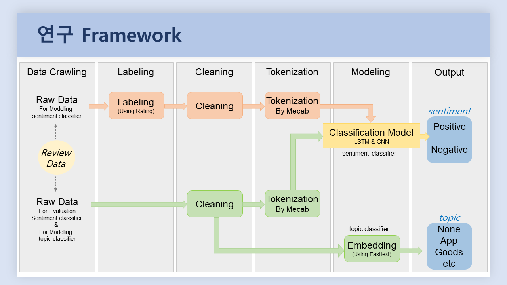

# NLP_Review_Classifier

<a href = "https://github.com/kh-kim/simple-ntc" title = "git repository로 이동" target="_blank">Source Code From Fastcampus</a>

## 2021년 춘계공동학술대회 발표 _ 대한산업공학회

### 연구 제목 : 딥러닝 기반 텍스트 분류 모델을 활용한 국내 이커머스 사용자 리뷰 분석

#### 연구 설명

- 본 연구는 쿠팡, SSG닷컴, 롯데ON의 App리뷰를 비교 분석하여 각 어플의 고객만족도를 조사한다. 


- 연구 환경
    - Python Framework인 Pytorch를 활용하여 연구를 진행
        - Python 3.6 or higher
        - PyTorch 1.6 or higher
        - PyTorch Ignite
        - TorchText 0.5 or higher
    - 연구자의 Windows Local 환경에서 동작이 어려운 몇몇 코드는 Google Colab을 활용하여 연구를 진행
        - Colab의 !bash 명령어로 Ubuntu Linux 활용

#### 연구 순서



    1. Data Crawling

    2. Labeling

    3. Cleaning
   
    4. Tokenization

    5. Modeling

    6. Output Analysis

## 연구 과정

### 1. Data Crawling

1. Corpus 수집을 위한 데이터 스크래핑
    1. For Modeling _ Sentiment Classifier
    2. For Evaluation _ Sentiment Classifier & For Modeling _ Topic Classifier

2. 수집된 Corpus를 날짜별로 분류 (디지털 전환 전과 후)
    - 전환 전의 데이터와 후의 데이터를 비교
    - 추가적으로 최종 모델의 Test를 위한 약간의 Data Set 확보


### 2. Labeling

- Sentiment Classifier Modeling에 필요한 Corpus에 Labeling
- App Review에 대해서 Sentiment와 Topic에 대한 Test Data Set에 Lebeling


### 3. Cleaning

- Regular Expression을 이용한 전각문자 및 불필요한 특수문자 제거
- Colab에서 진행
- 진행 순서
    1. refine.py / refine.regex.txt 파일을 Colab에 업로드
    2. !bash실행
    3. 아래 코드 입력
    ```bash
    $ python refine.py refine.regex.txt 1 < refine전_파일명 > refine후_파일명
    ```


### 4. Tokenization

- mecab을 활용한 tokenize
- 진행순서
    1. Colab에 Mecab설치
    2. tokenize.sh 파일을 Colab에 업로드
    3. !bash실행
    4. chmod 555 ./tokenize.sh 실행 (권한 부여)
    5. 아래 코드 입력
    ```bash
    $ ./tokenize.sh tok전_파일명 tok후_파일명
    ```


### 5. Modeling

1. Sentimental Classifier Using Pytorch (LSTM & CNN)

2. Topic Classifier Using Fasttext


### 6. Output Analysis